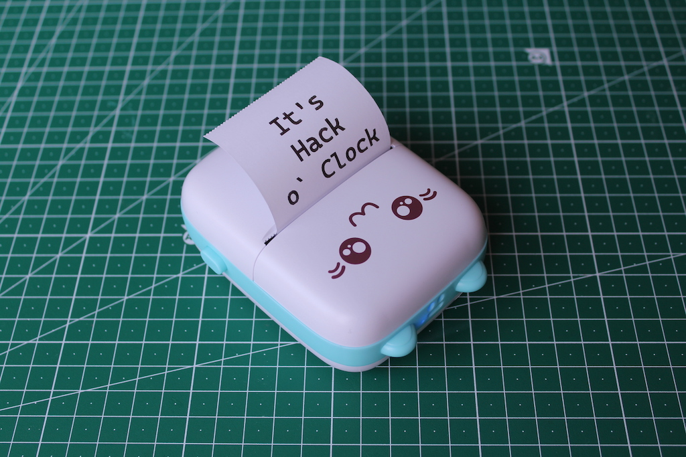
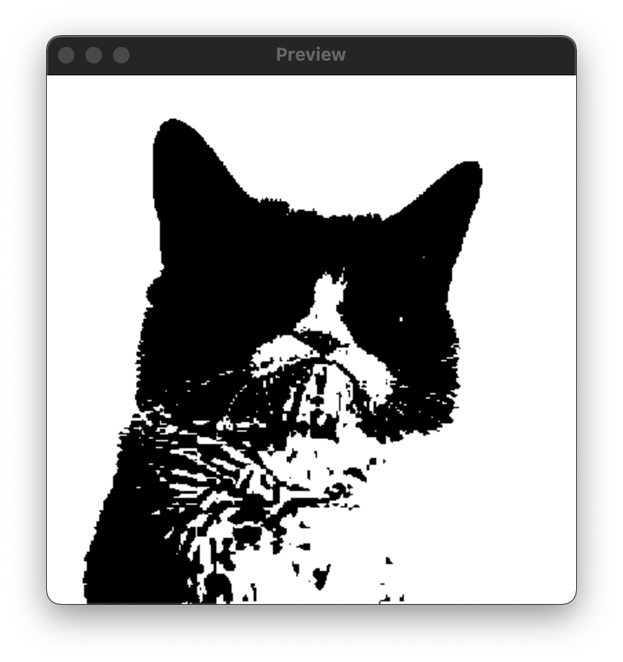
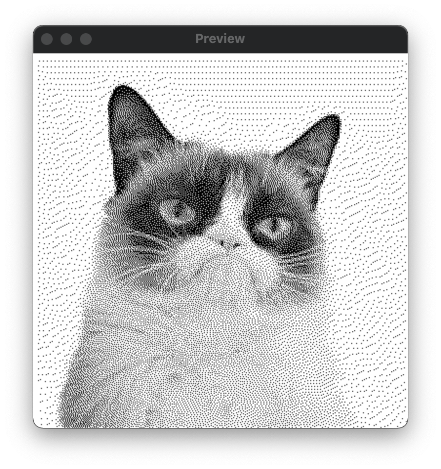
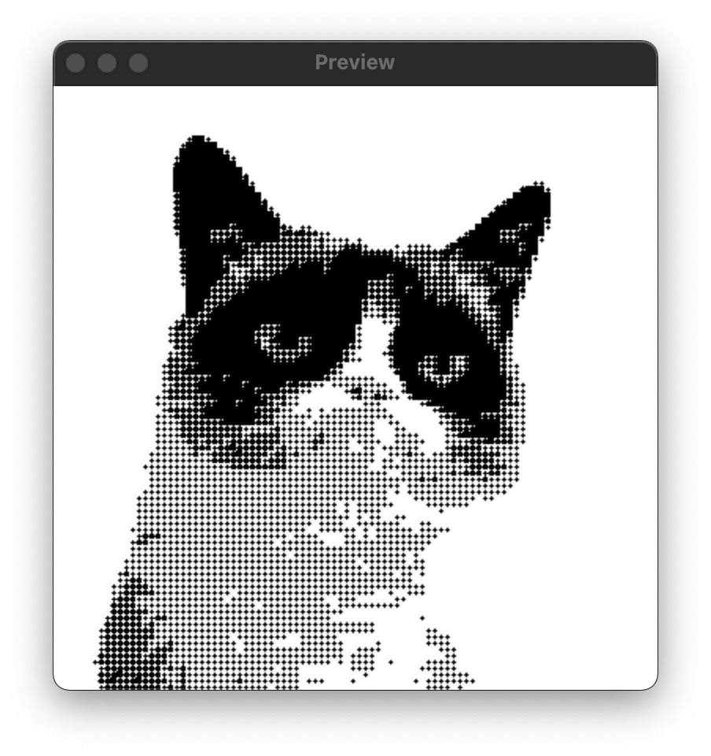

  

Cat printer is a portable thermal printer sold on AliExpress for around $20.

  

This repository contains Python code for talking to the cat printer over Bluetooth Low Energy (BLE). The code has been reverse engineered from the [official Android app](https://play.google.com/store/apps/details?id=com.frogtosea.iprint&hl=en_US&gl=US).

  

# Installation

```bash

# Clone the repository.

$  git  clone  git@github.com:eshangonemad/kittyprinar

$  cd  kittyprinar

# Create a virtualenv on venv/ and activate it.

$  virtualenv  --python=python3  venv

$  source  venv/bin/activate

# Install requirements from requirements.txt.

$  pip  install  -r  requirements.txt

```
^^ This did not work for me on windows ^^
What I did
``` 
1| (clone the repo)
2| (open the folder on vscode)
3| (open terminal on the folder)
4| pip  install  -r  requirements.txt 
	^(to install the files)^
 ```

  

# Usage

```bash

$  ./print.py  --help

usage:  print.py [-h] [-l {debug,info,warn,error}]

[-b {mean-threshold,floyd-steinberg,halftone,none}] [-s]

[-d DEVICE] [-t]

filename

  

prints  an  image  on  your  cat  thermal  printer

  

positional  arguments:

filename

  

optional  arguments:usage: print.py [-h] [-t TEXT] [-l {debug,info,warn,error}] [-b {mean-threshold,floyd-steinberg,halftone,none}] [-s] [-d DEVICE] [-darker] [-f FONT]
                [--font-size FONT_SIZE]
                [filename]

Prints an image or text on your cat thermal printer.

positional arguments:
  filename              Path to the image file or text string to print.

options:
  -h, --help            show this help message and exit
  -t TEXT, --text TEXT  Text string to convert to an image and print (use \n for new lines).
  -l {debug,info,warn,error}, --log-level {debug,info,warn,error}
  -b {mean-threshold,floyd-steinberg,halftone,none}, --img-binarization-algo {mean-threshold,floyd-steinberg,halftone,none}
                        Which image binarization algorithm to use. If 'none' is used, no binarization will be used. In this case, the image has to have a width of    
                        384 px.
  -s, --show-preview    If set, displays the final image and asks the user for confirmation before printing.
  -d DEVICE, --device DEVICE
                        The printer's Bluetooth Low Energy (BLE) address (MAC address on Linux; UUID on macOS) or advertisement name (e.g.: "GT01", "GB02", "GB03").  
                        If omitted, the script will try to auto discover the printer based on its advertised BLE services.
  -darker               Print the image in text mode. This leads to more contrast, but slower speed.
  -f FONT, --font FONT  Path to a TTF font file to use for the text.
  --font-size FONT_SIZE
                        Font size to use for the text.

```

  

# Example

```bash
FOR WINDOWS:

python print.py  --show-preview  test.png

⏳  Applying  Floyd-Steinberg  dithering  to  image...

✅  Done.

ℹ️  Displaying  preview.

🤔  Go  ahead  with  print? [Y/n]?

✅  Read  image: (42, 384) (h,  w) pixels

✅  Generated  BLE  commands:  2353  bytes

⏳  Looking  for  a  BLE  device  named  GT01...

✅  Got  it.  Address:  09480C21-65B5-477B-B475-C797CD0D6B1C:  GT01

⏳  Connecting  to  09480C21-65B5-477B-B475-C797CD0D6B1C:  GT01...

✅  Connected:  True; MTU:  104

⏳  Sending  2353  bytes  of  data  in  chunks  of  101  bytes...

✅  Done.

```

  
  

# Different Algorithms

  

Mean Threshold:



  

Floyd Steinberg (default)



  

Halftone dithering

